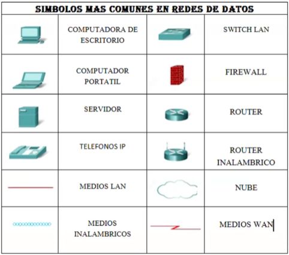
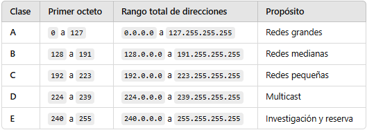
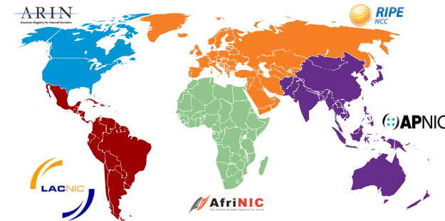
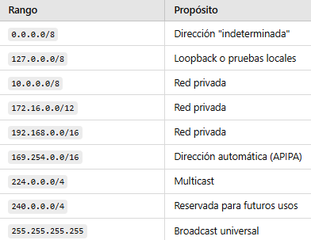
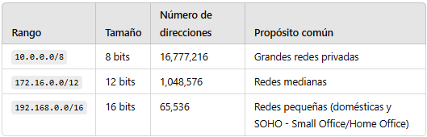
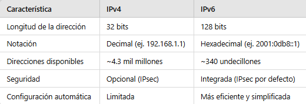
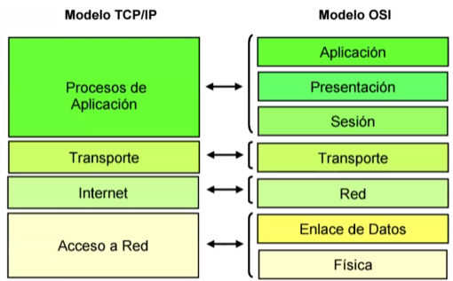
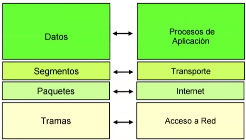
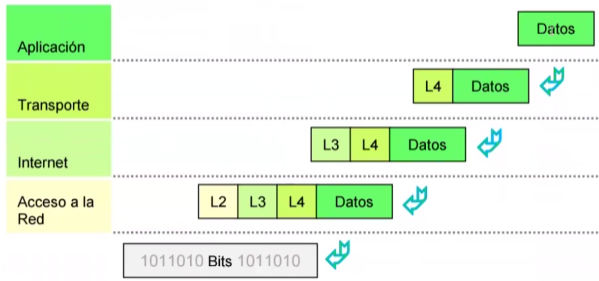
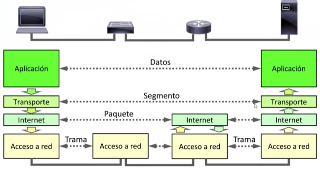

# Técnico Telecomunicaciones CCNA 200-301

- [Técnico Telecomunicaciones CCNA 200-301](#técnico-telecomunicaciones-ccna-200-301)
  - [Introducción](#introducción)
    - [Elementos de una red](#elementos-de-una-red)
    - [Símbología en las redes de datos](#símbología-en-las-redes-de-datos)
  - [Direccionamiento IP](#direccionamiento-ip)
  - [Direcciones IPv4 Públicas y Privadas](#direcciones-ipv4-públicas-y-privadas)
    - [Máscara de subred](#máscara-de-subred)
    - [Clasificación de las direcciones IPv4](#clasificación-de-las-direcciones-ipv4)
      - [Clase A](#clase-a)
      - [Clase B](#clase-b)
      - [Clase C](#clase-c)
      - [Clase D](#clase-d)
      - [Clase E](#clase-e)
  - [Asignación de direcciones IP](#asignación-de-direcciones-ip)
    - [Direcciones IPv4 especiales](#direcciones-ipv4-especiales)
      - [¿Por qué estas direcciones son de propósito privado?](#por-qué-estas-direcciones-son-de-propósito-privado)
      - [¿Se pueden asignar estas direcciones a los hosts?](#se-pueden-asignar-estas-direcciones-a-los-hosts)
      - [¿Por qué no se pueden usar en Internet?](#por-qué-no-se-pueden-usar-en-internet)
      - [Ventajas de usar redes privadas](#ventajas-de-usar-redes-privadas)
      - [Ejemplo práctico](#ejemplo-práctico)
    - [¿Qué es CIDR?](#qué-es-cidr)
      - [¿Cómo funciona el CIDR para subredes?](#cómo-funciona-el-cidr-para-subredes)
      - [Ventajas del CIDR](#ventajas-del-cidr)
      - [Ejemplo 1: Crear subredes de una red principal](#ejemplo-1-crear-subredes-de-una-red-principal)
      - [Ejemplo 2: Identificar la subred de una IP](#ejemplo-2-identificar-la-subred-de-una-ip)
  - [Direcciones IPv6](#direcciones-ipv6)
    - [¿Qué es IPv6?](#qué-es-ipv6)
    - [¿Por qué necesitamos IPv6?](#por-qué-necesitamos-ipv6)
    - [Diferencias entre IPv4 e IPv6](#diferencias-entre-ipv4-e-ipv6)
    - [¿Cómo son las direcciones IPv6?](#cómo-son-las-direcciones-ipv6)
    - [Reglas para simplificar direcciones](#reglas-para-simplificar-direcciones)
    - [Beneficios de IPv6](#beneficios-de-ipv6)
    - [¿IPv6 reemplaza completamente a IPv4?](#ipv6-reemplaza-completamente-a-ipv4)
    - [Dirección Unicast Global de Ejemplo](#dirección-unicast-global-de-ejemplo)
    - [Dirección Link-Local de Ejemplo](#dirección-link-local-de-ejemplo)
    - [Dirección Multicast de Ejemplo](#dirección-multicast-de-ejemplo)
    - [Dirección Unicast de Ejemplo](#dirección-unicast-de-ejemplo)
    - [Dirección Anycast de Ejemplo](#dirección-anycast-de-ejemplo)
    - [Dirección IPv4-Mapeada de Ejemplo](#dirección-ipv4-mapeada-de-ejemplo)
    - [Dirección Loopback de Ejemplo](#dirección-loopback-de-ejemplo)
    - [Dirección No Especificada de Ejemplo](#dirección-no-especificada-de-ejemplo)
    - [Dirección Multicast para Todos los Routers de Ejemplo](#dirección-multicast-para-todos-los-routers-de-ejemplo)
    - [Dirección Site-Local (Obsoleta, pero educativa) de Ejemplo](#dirección-site-local-obsoleta-pero-educativa-de-ejemplo)
  - [Protocolos TCP/IP](#protocolos-tcpip)
    - [Red LAN](#red-lan)
    - [Red WAN](#red-wan)
      - [Internet (WWW)](#internet-www)
    - [TCP/IP](#tcpip)
  - [Introducción a los Modelos de Referencia](#introducción-a-los-modelos-de-referencia)
    - [Modelo OSI](#modelo-osi)
    - [Modelo TCP/IP](#modelo-tcpip)
      - [Encapsulación de paquetes](#encapsulación-de-paquetes)
      - [Dispositivos integrados en el Modelo TCP/IP](#dispositivos-integrados-en-el-modelo-tcpip)

---

## Introducción

Técnico Telecomunicaciones CCNA es un curso con documentación sobre las configuraciones en las redes siguiendo la nomenclatura establecida en CCNA 200-301.

### Elementos de una red

Los principales elementos que componen las redes:

- Dispositivos finales: _Host_, _Servidores_.
- Dispositivos intermedios: _Router_, _Switch_, _Firewall_, _Access Points_.
- Medios físicos: _cables estructurados_ (cobre), _cables de fibra óptica_.
- Medios de transmisión inalámbricos: usan radiofrecuencia (WiFi), enlaces a través de satélites (WLAN)
- Tarjetas de red (NIC).
- Mapa del cableado mundial: [Cable submarino](https://www.submarinecablemap.com/).

### Símbología en las redes de datos




---

## Direccionamiento IP

Una dirección IPv4 es una línea de 32 bits, separados en cuatro grupos con 8 bits cada uno llamados _octetos_. Cada uno de los _octetos_ están separados entre sí por un punto.

Una dirección IPv4 está dividida en dos partes: una porción de bits direccionan la red y el resto de bits están destinados a direccionar los host.

- Las direcciones IPv4 que terminen en **0**, están destinadas a direccionar la **Red**.
- Los direcciones IPv4 que terminen en **255**, están destinadas al **Broadcas**.

## Direcciones IPv4 Públicas y Privadas

Algunas direcciones IPv4 no se pueden usar para salir a Internet y otras se asignan específicamente para enrutar a Internet.

Las direcciones IPv4 públicas, son direcciones que se enrutan globalmente entre Routers de proveedores de servicios de Internet (ISP). No obstante, no todas las direcciones IPv4 disponibles pueden usarse en Internet.

Existen bloques de direcciones denominadas, direcciones privadas que la mayoría de las organizaciones usan para asignar a los hosts internos. Las direcciones IPv4 privadas no son exclusivas y cualquier red interna puede usarlas.

| Dirección de Red/Prefijo | Rango direcciones privadas RFC 1918 |
| --- | --- |
| 10.0.0.0/8 | 10.0.0.0 a 10.255.255.255 |
| 172.16.0.0/12 | 172.16.0.0 a 172.31.255.255 |
| 192.168.0.0/16 | 192.168.0.0 a 192.168.255.255 |

### Máscara de subred

Representación de cuatro _octetos_ con 8 bits. Se ponen a 1 lógico todos los bits de la dirección IP destinados a direccionar la red, y el resto de bits se ponen a 0 lógico, son los destinados a direccionar los host.


### Clasificación de las direcciones IPv4

Dependiendo del rango, se determinan a qué clase pertenecen las direcciones IPv4.

| Clase | IP mínimo | IP máximo | Máscara (defecto) | Dir. Red | Dir. Host |
| :---: | --- | --- | :---: | ---: | :--- |
| A | 00000000.0.0.0 = 0.0.0.0       | 127.255.255.255 | R.H.H.H = /8 | 255. | .0.0.0 |
| B | **1**0000000.0.0.0 = 128.0.0.0 | 191.255.255.255 | R.R.H.H = /16 | 255.255. | 0.0 |
| C | **11**000000.0.0.0 = 192.0.0.0 | 223.255.255.255 | R.R.R.H = /24 | 255.255.255. | .0 |
| D | **111**00000.0.0.0 = 224.0.0.0 | 239.255.255.255 | multicast | - | - |
| E | **1111**0000.0.0.0 = 240.0.0.0 | 247.255.255.255 | investigación | - | - |

#### Clase A

- Propósito: Redes muy grandes, generalmente asignadas a grandes organizaciones o proveedores.
- Primer octeto (rango): 0 a 127 (en formato decimal).
- Rango total de direcciones:
  - Mínima: 0.0.0.0
  - Máxima: 127.255.255.255
- Bits iniciales: Siempre comienzan con 0.
- Rango de redes asignables:
  - Desde 1.0.0.0 (porque 0.0.0.0 es especial)
  - Hasta 126.255.255.255 (porque 127.x.x.x es reservado para loopback).
- Máscara predeterminada: 255.0.0.0 o /8
- Número de redes: 128 (aunque solo 126 asignables).
- Número de hosts por red: 2<sup>24</sup> - 2 = 16.777.214 (se excluyen la dirección de red y broadcast).

#### Clase B

- Propósito: Redes medianas, asignadas a universidades, empresas y organizaciones de tamaño medio.
- Primer octeto (rango): 128 a 191.
- Rango total de direcciones:
  - Mínima: 128.0.0.0
  - Máxima: 191.255.255.255
- Bits iniciales: Siempre comienzan con 10.
- Rango de redes asignables:
  - Desde 128.0.0.0
  - Hasta 191.255.0.0.
- Máscara predeterminada: 255.255.0.0 o /16
- Número de redes: 2<sup>14</sup> = 16.384.
- Número de hosts por red: 2<sup>16</sup> - 2 = 65.534.

#### Clase C

- Propósito: Redes pequeñas, utilizadas en organizaciones pequeñas o redes domésticas.
- Primer octeto (rango): 192 a 223.
- Rango total de direcciones:
  - Mínima: 192.0.0.0
  - Máxima: 223.255.255.255
- Bits iniciales: Siempre comienzan con 110.
- Rango de redes asignables:
  - Desde 192.0.0.0
  - Hasta 223.255.255.0.
- Máscara predeterminada: 255.255.255.0 o /24
- Número de redes: 2<sup>21</sup> = 2.097.152.
- Número de hosts por red: 2<sup>8</sup> - 2 = 254.

#### Clase D

- Propósito: Direcciones para multicast (comunicación a un grupo específico de dispositivos).
- Primer octeto (rango): 224 a 239.
- Rango total de direcciones:
  - Mínima: 224.0.0.0
  - Máxima: 239.255.255.255
- Bits iniciales: Siempre comienzan con 1110.
- Características:
  - No se dividen en redes y hosts.
  - No tienen máscara de subred.
  - Usadas en transmisión de datos como video o streaming.

#### Clase E

- Propósito: Reservadas para investigación y uso futuro.
- Primer octeto (rango): 240 a 255.
- Rango total de direcciones:
  - Mínima: 240.0.0.0
  - Máxima: 255.255.255.255
- Bits iniciales: Siempre comienzan con 1111.
- Características:
  - No se asignan a redes normales.
  - La dirección 255.255.255.255 es de **broadcast universal**.

Tabla resumen.



## Asignación de direcciones IP

Las direcciones IPv4 públicas son direcciones en las que se realiza routing globalmente entre los routers ISP. Las direcciones IPv4 públicas deben ser únicas.

Tanto las direcciones IPv4 como las IPv6 son administradas por la Autoridad de Números Asignados a Internet (Internet Assigned Numbers Authority, IANA). La IANA administra y asigna bloques de direcciones IP a los Registros Regionales de Internet (RIR). Los cinco RIR se muestran en la figura.

Los RIR se encargan de asignar direcciones IP a los ISP, quienes a su vez proporcionan bloques de direcciones IPv4 a las organizaciones y a los ISP más pequeños. Las organizaciones pueden obtener sus direcciones directamente de un RIR, según las políticas de ese RIR.



- **AfriNIC** (Centro de Información de Redes Africano) - Región de África
- **APNIC** (Centro de Información de Redes de Asia Pacífico) - Región de Asia/Pacífico
- **ARIN** (Registro Americano de Números de Internet) - Región de América del Norte
- **LACNIC** (Registro Regional de Direcciones IP de América Latina y el Caribe) - América Latina y algunas Islas del Caribe
- **RIPE NCC**(Réseaux IP Européens Network Coordination Centre) - Europa, Medio Oriente y Asia Central

### Direcciones IPv4 especiales

1. **Dirección de red** (**0.0.0.0**)

   - _Propósito_: Representa una dirección "indeterminada". Se utiliza cuando un dispositivo no tiene aún una dirección IP asignada o para referirse a "todas las direcciones posibles".
   - _Ejemplo de uso_: Enrutadores que envían solicitudes para obtener una dirección IP por DHCP.

2. Dirección de **loopback** (**127.0.0.0/8**)

    - _Propósito_: Se usa para probar la comunicación dentro de un mismo dispositivo. Cuando envías datos a esta dirección, no salen de tu computadora.
    - _Rango completo_: Desde 127.0.0.0 hasta 127.255.255.255.
    - _Ejemplo de uso_: Probar si el protocolo TCP/IP funciona correctamente con ping 127.0.0.1. Esta dirección se conoce comúnmente como "localhost".

3. **Direcciones de red privada** (RFC 1918)

    - _Propósito_: Son direcciones reservadas para redes locales y no son enrutables en Internet.
    - _Rangos definidos_:
        - **10.0.0.0/8** (10.0.0.0 a 10.255.255.255)
        - **172.16.0.0/12** (172.16.0.0 a 172.31.255.255)
        - **192.168.0.0/16** (192.168.0.0 a 192.168.255.255)
    - _Ejemplo de uso_: Direcciones IP para redes domésticas o empresariales pequeñas.

4. Dirección de **broadcast** (**255.255.255.255**)

    - _Propósito_: Se usa para enviar datos a todos los dispositivos de una red local simultáneamente.
    - _Ejemplo de uso_: Mensajes ARP o descubrimiento de servicios en redes locales.

5. **Dirección de red limitada** (**169.254.0.0/16**)

    - _Propósito_: Direcciones asignadas automáticamente cuando un dispositivo no puede obtener una IP mediante DHCP.
    - _Rango completo_: Desde 169.254.0.0 hasta 169.254.255.255.
    - _Ejemplo de uso_: Un equipo desconectado de una red asignará una dirección dentro de este rango.

6. **Direcciones reservadas** para futuras investigaciones

    - _Propósito_: Estas direcciones están reservadas y no deben usarse en redes públicas ni privadas.
    - _Rangos conocidos_: **240.0.0.0/4** (240.0.0.0 a 255.255.255.254).

7. Dirección de red **multicast** (**224.0.0.0/4**)

    - _Propósito_: Se usa para enviar paquetes a un grupo específico de dispositivos en una red.
    - _Rango completo_: Desde 224.0.0.0 hasta 239.255.255.255.
    - _Ejemplo de uso_: Transmisión de datos de video o voz a múltiples receptores.



#### ¿Por qué estas direcciones son de propósito privado?

1. Reservadas por la IETF (**RFC 1918**):

   - Estas direcciones fueron definidas como privadas en el estándar RFC 1918, para evitar conflictos en Internet y garantizar que las redes internas puedan operar sin necesidad de direcciones públicas.
   - Esto significa que estos rangos **no son válidos en Internet**; no se pueden enrutar más allá de la red local (LAN).

2. Ahorro de direcciones públicas:

    - Las direcciones públicas (aquellas que pueden usarse en Internet) son limitadas. Al reservar estos rangos para uso interno, muchas organizaciones pueden reutilizarlos sin consumir direcciones públicas.
    - Por ejemplo: Dos empresas diferentes pueden usar 192.168.1.0/24 en sus redes privadas sin interferir entre sí.

3. Aislamiento de redes locales:

    - Estas direcciones permiten que los dispositivos de una red privada se comuniquen entre sí, pero necesitan un dispositivo como un router con **NAT** (Traducción de Direcciones de Red) para acceder a Internet.

Estos son los rangos específicos de redes privadas reservados:



#### ¿Se pueden asignar estas direcciones a los hosts?

¡Sí! Estas direcciones son perfectamente válidas para asignarlas a los hosts dentro de una red privada. Por ejemplo:

1. Asignación estática:

   - Puedes configurar manualmente una dirección como 192.168.1.10 en tu computadora si pertenece al rango de la red.
   - Asegúrate de incluir:
        - Dirección IP: Ej. 192.168.1.10.
        - Máscara de subred: Ej. 255.255.255.0 (para redes /24).
        - Puerta de enlace: Ej. 192.168.1.1 (el router).

2. Asignación dinámica (**DHCP**):

   - En redes modernas, un servidor **DHCP** (normalmente el router) asigna automáticamente direcciones privadas a los dispositivos.
   - Ejemplo: El router puede asignar direcciones del rango 192.168.0.2 a 192.168.0.254.

#### ¿Por qué no se pueden usar en Internet?

1. No enrutable en Internet:

    - Los routers de Internet están configurados para descartar paquetes provenientes de estas direcciones privadas. Esto evita que una red privada interfiera con otra en Internet.

2. NAT (Network Address Translation):

    - Para que un dispositivo con una IP privada acceda a Internet, necesita un router con NAT. Este traduce las direcciones privadas en una dirección pública válida que sí pueda enrutar.

#### Ventajas de usar redes privadas

1. Reutilización de direcciones:

    - Como estas direcciones no salen de la red local, diferentes redes privadas pueden usar los mismos rangos sin problemas.

2. Seguridad:

    - Las direcciones privadas están "ocultas" de Internet, lo que agrega una capa de protección frente a ataques externos.

3. Flexibilidad:

    - Puedes dividir estos rangos para múltiples subredes dentro de tu organización.

#### Ejemplo práctico

1. Red doméstica típica:

    - El router doméstico asigna direcciones del rango 192.168.1.0/24 a los dispositivos:
        - Computadora: 192.168.1.2
        - Teléfono: 192.168.1.3
        - Impresora: 192.168.1.4

2. Red empresarial:

    - Una empresa grande puede usar el rango 10.0.0.0/8 para configurar miles de subredes:
        - Subred para oficinas: 10.1.0.0/16
        - Subred para servidores: 10.2.0.0/16

En resumen:

- Estas direcciones son privadas porque están reservadas para redes locales y no son válidas en Internet.
- Sí se pueden asignar a hosts, pero solo dentro de una red privada.
- Para acceder a Internet desde estas redes, necesitas un router con NAT que traduzca las direcciones privadas en una pública.

### ¿Qué es CIDR?

El sistema de clases (Classful Addressing) ha sido reemplazado por el CIDR (Classless Inter-Domain Routing), que permite mayor flexibilidad al asignar redes de cualquier tamaño sin estar limitado a clases específicas.

El **CIDR** es un método de direccionamiento IP introducido para reemplazar el sistema rígido de clases de IPv4. Permite dividir redes en subredes de cualquier tamaño (de forma más eficiente) al usar máscaras de subred de longitud variable (VLSM).

- En vez de usar clases fijas (A, B, C), las direcciones IP con CIDR usan un prefijo para indicar cuántos bits son para la red.
- El prefijo CIDR se representa como /N, donde N es el número de bits en la máscara de red.

Por ejemplo: 192.168.1.0/24 indica que los primeros 24 bits son para identificar la red. Esto es equivalente a la máscara 255.255.255.0.

#### ¿Cómo funciona el CIDR para subredes?

Con CIDR, podemos crear subredes dividiendo una red principal en bloques más pequeños. Esto se hace aumentando el número de bits en la máscara de red.

Fórmulas clave para subredes:

1. Cantidad de subredes: 2<sup>_n_</sup>, donde _n_ es el número de bits "prestados" de la parte de host para la parte de red.
2. Cantidad de hosts por subred: 2<sup>m</sup> - 2, donde m es el número de bits restantes para los hosts (se restan 2 para excluir la dirección de red y de broadcast).
3. Tamaño de cada subred: 2<sup>𝑚</sup>  direcciones (incluyendo red y broadcast).
4. Intervalo entre subredes: El incremento entre direcciones de red es igual al tamaño de la subred.

#### Ventajas del CIDR

1. Eficiencia: Permite asignar solo las direcciones necesarias sin desperdicio.
2. Flexibilidad: Las redes pueden ser del tamaño exacto que se requiere, sin ajustarse a las clases fijas.
3. Reducción de tablas de enrutamiento: CIDR puede agrupar múltiples redes en un solo prefijo, reduciendo la complejidad del enrutamiento (ej., agregación de rutas).

#### Ejemplo 1: Crear subredes de una red principal

Supongamos que tienes la red 192.168.1.0/24 y quieres dividirla en 4 subredes.

1. Determinar los bits necesarios para subredes:

   - 2<sup>_n_</sup> ≥ 4, donde _n_ es el número de bits prestados.
     - _n_ = 2, porque 2<sup>2</sup> = 4.
   - Máscara original: /24 → Nueva máscara: /26 (se añaden 2 bits).

2. Tamaño de cada subred:

   - 2<sup>6</sup> = 64 direcciones por subred (32 - 26 = 6, bits para hosts).

3. Direcciones de red y broadcast: Dividimos en bloques de 64 direcciones:

   - Subred 1:
     - Dirección de red: 192.168.1.0
     - Dirección de broadcast: 192.168.1.63
     - Rango de hosts: 192.168.1.1 a 192.168.1.62
   - Subred 2:
     - Dirección de red: 192.168.1.64
     - Dirección de broadcast: 192.168.1.127
     - Rango de hosts: 192.168.1.65 a 192.168.1.126
   - Subred 3:
     - Dirección de red: 192.168.1.128
     - Dirección de broadcast: 192.168.1.191
     - Rango de hosts: 192.168.1.129 a 192.168.1.190
   - Subred 4:
     - Dirección de red: 192.168.1.192
     - Dirección de broadcast: 192.168.1.255
     - Rango de hosts: 192.168.1.193 a 192.168.1.254

#### Ejemplo 2: Identificar la subred de una IP

Supongamos que tienes la red 10.0.0.0/16 y te preguntan a qué subred pertenece la dirección 10.0.5.100 si divides en subredes de /20.

1. Tamaño de cada subred:

   - Máscara original: /16 → Nueva máscara: /20.
   - Número de bits para hosts: 32 - 20 = 12.
   - Tamaño de subred: 2<sup>12</sup> = 4.096 direcciones.

2. Intervalo entre subredes:

   - Cada subred abarca 4.096 direcciones.
   - Incremento entre subredes: 4,096 direcciones → En formato decimal, es un incremento de 16 en el tercer octeto (4.096/256=16).

3. Rangos de subredes:

   - Subred 1: 10.0.0.0 a 10.0.15.255
   - Subred 2: 10.0.16.0 a 10.0.31.255
   - Subred 3: 10.0.32.0 a 10.0.47.255 (y así sucesivamente).

4. Ubicación de la IP:

   - La dirección 10.0.5.100 pertenece a la primera subred, ya que está dentro del rango 10.0.0.0 a 10.0.15.255.

***

## Direcciones IPv6

### ¿Qué es IPv6?

IPv6 (Protocolo de Internet versión 6) es la versión más reciente del protocolo de Internet, que es como el sistema que permite a los dispositivos (computadoras, teléfonos, servidores, etc.) comunicarse entre sí a través de redes como Internet. Es el sucesor de IPv4, que es la versión que se usa ampliamente desde los inicios de Internet.

### ¿Por qué necesitamos IPv6?

IPv4 tiene una limitación importante: se están acabando las direcciones IP. IPv4 usa direcciones de 32 bits, lo que permite alrededor de 4.3 mil millones de direcciones únicas. Sin embargo:

- Hay más dispositivos conectados a Internet que direcciones disponibles.
- IPv4 no fue diseñado para manejar el crecimiento exponencial de Internet.

IPv6 resuelve este problema usando direcciones mucho más grandes, de 128 bits, permitiendo aproximadamente 340 undecillones (un número inimaginablemente grande) de direcciones. Esto asegura que haya suficientes direcciones para todos los dispositivos, ahora y en el futuro.

### Diferencias entre IPv4 e IPv6



### ¿Cómo son las direcciones IPv6?

Una dirección IPv6 es más larga y se ve diferente a una de IPv4. Está compuesta por 8 grupos de números hexadecimales, separados por dos puntos (:). Por ejemplo:

```hexadecimal
  2001:0db8:85a3:0000:0000:8a2e:0370:7334
```

### Reglas para simplificar direcciones

1. Omitir ceros iniciales: Puedes omitir los ceros al inicio de un grupo. Ejemplo:
   - 01ab se convierte en 1ab.
2. Usar :: para ceros consecutivos: Puedes reemplazar múltiples grupos de ceros consecutivos con :: una vez en la dirección. Ejemplo:
   - 2001:0db8:0000:0000:0000:0000:0000:0001 se simplifica a 2001:db8::1.

### Beneficios de IPv6

1. Más direcciones: Es el principal beneficio. No hay peligro de quedarse sin direcciones.
2. Mejor rendimiento y eficiencia:
   - Configuración automática: Los dispositivos pueden configurarse automáticamente sin necesitar DHCP (protocolo que asigna IP en IPv4).
   - Mejora en el enrutamiento: Los paquetes viajan de forma más eficiente.
3. Seguridad integrada: Incluye soporte nativo para IPsec, un conjunto de protocolos para cifrar y autenticar el tráfico de red.
4. Soporte para el Internet de las Cosas (IoT): Con tantos dispositivos conectados, IPv6 es fundamental para soportar este ecosistema.

### ¿IPv6 reemplaza completamente a IPv4?

Por ahora, no. IPv4 sigue siendo ampliamente usado, pero IPv6 está ganando terreno. Muchos sistemas funcionan con ambos protocolos a la vez (esto se llama doble pila, o dual stack).

1. Dirección Unicast Global

  > Ejemplo: `2001:0db8:85a3:0000:0000:8a2e:0370:7334` <br>
  > Descripción:

  > - Es una dirección unicast global, utilizada para identificar un único dispositivo en Internet.
  > - Es equivalente a las direcciones públicas en IPv4.
  > - Empiezan generalmente con 2000::/3 (bloques que inician con 2 o 3), lo que indica que pertenecen al rango de direcciones globales.

2. Dirección Link-Local

  > Ejemplo: `fe80::1` <br>
  > Descripción:

  > - Estas direcciones comienzan con fe80::/10 y se usan para comunicación dentro de una red local.
  > - No son enrutables, lo que significa que no pueden salir del enlace local (un solo segmento de red, como tu router).
  > -Se configuran automáticamente en cada interfaz de red, incluso si no hay un servidor DHCP.
  > -Ejemplo práctico: un dispositivo puede usar esta dirección para hablar con su router sin necesitar una IP pública.

3. Dirección de Loopback

  > Ejemplo: `::1` <br>
  > Descripción:

  > - Es la versión IPv6 de 127.0.0.1 en IPv4.
  > - Sirve para que un dispositivo pueda enviarse mensajes a sí mismo.
  > - Se usa comúnmente para pruebas o diagnósticos de red en el propio dispositivo.

4. Dirección Multicast

  > Ejemplo: `ff02::1` <br>
  > Descripción:

  > - Las direcciones multicast comienzan con ff00::/8 y se utilizan para enviar paquetes a múltiples dispositivos simultáneamente en una red.
  > - ff02::1 es una dirección especial que significa "todos los nodos en el enlace local".
  > - Ejemplo práctico: un mensaje enviado a esta dirección será recibido por todos los dispositivos de la red local.

5. Dirección de Ejemplo (Documentation Address)

  > Ejemplo: `2001:0db8::/32` <br>
  > Descripción:

  > - Estas direcciones están reservadas para ejemplos y documentación técnica.
  > - Nunca se usarán en redes reales.
  > - Ejemplo práctico: son las que ves en libros, guías y tutoriales como este.

6. Dirección Anycast

  > Ejemplo: `2001:0db8:85a3::1` (puede ser cualquier dirección unicast configurada como anycast) <br>
  > Descripción:

  > - Una dirección anycast se asigna a múltiples dispositivos, pero cuando alguien intenta comunicarse con ella, el tráfico se dirige al dispositivo más cercano (en términos de red).
  > - Uso típico: balanceo de carga o servicios distribuidos, como servidores de DNS.

7. Dirección Reservada (Inutilizable)

  > Ejemplo: `::` <br>
  > Descripción:

  > - Es una dirección especial llamada dirección no especificada.
  > - Indica la ausencia de dirección.
  > - Ejemplo práctico: durante el inicio de un dispositivo antes de que obtenga una IP válida.

8. Dirección IPv4-Mapeada en IPv6

  > Ejemplo: `::ffff:192.0.2.128` <br>
  > Descripción:

  > - Estas direcciones permiten que IPv6 sea compatible con IPv4.
  > - El prefijo ::ffff: se usa para representar una dirección IPv4 dentro de un entorno IPv6.
  > - Ejemplo práctico: servidores que admiten tanto IPv4 como IPv6 usan estas direcciones para procesar clientes IPv4.

### Dirección Unicast Global de Ejemplo

Dirección: `2001:db8:abcd:0012:0000:0000:0000:0001`
Prefijo de red: `/64`
Explicación:

- Es una dirección unicast global que identifica un único dispositivo en Internet.
- El prefijo /64 indica que los primeros 64 bits son la parte de red, y los restantes son la parte de host.
- Se usa para comunicación en redes globales.

### Dirección Link-Local de Ejemplo

Dirección: `fe80::1`
Prefijo de red: `/10`
Explicación:

- Es una dirección link-local, que solo es válida dentro del enlace local (segmento de red).
- El prefijo /10 indica que las direcciones link-local comienzan con los 10 bits 1111111010.
- No es enrutable y se genera automáticamente en las interfaces de red.

### Dirección Multicast de Ejemplo

Dirección: `ff02::1`
Prefijo de red: `/8`
Explicación:

- Es una dirección multicast para enviar datos a todos los nodos en un enlace local.
- El prefijo /8 significa que todas las direcciones que comienzan con ff son multicast.
- Se usa para enviar mensajes a varios dispositivos simultáneamente.

### Dirección Unicast de Ejemplo

Dirección: `2001:0db8:85a3::8a2e:370:7334`
Prefijo de red: `/32`
Explicación:

- Es una dirección reservada para documentación y no se utiliza en redes reales.
- El prefijo /32 identifica que pertenece al rango de direcciones de ejemplo 2001:db8::/32.

### Dirección Anycast de Ejemplo

Dirección: `2001:db8:abcd:0012::1`
Prefijo de red: `/64`
Explicación:

- Es una dirección unicast global que puede configurarse como anycast para identificar múltiples nodos.
- El prefijo /64 permite que la dirección sea parte de una subred estándar.

### Dirección IPv4-Mapeada de Ejemplo

Dirección: `::ffff:192.0.2.128`
Prefijo de red: `/96`
Explicación:

- Esta dirección permite representar direcciones IPv4 en un entorno IPv6.
- El prefijo /96 significa que los primeros 96 bits están reservados para IPv6, y los últimos 32 bits contienen la dirección IPv4.

### Dirección Loopback de Ejemplo

Dirección: `::1`
Prefijo de red: `/128`
Explicación:

- Es una dirección especial que apunta al propio dispositivo.
- El prefijo /128 indica que es una única dirección específica.
- Se usa para pruebas y diagnósticos locales.

### Dirección No Especificada de Ejemplo

Dirección: `::`
Prefijo de red: `/128`
Explicación:

- Es una dirección que indica ausencia de dirección.
- Se usa, por ejemplo, cuando un dispositivo aún no ha recibido una dirección válida.

### Dirección Multicast para Todos los Routers de Ejemplo

Dirección: `ff02::2`
Prefijo de red: `/8`
Explicación:

- Es una dirección multicast para comunicarse con todos los routers en un enlace local.
- Útil para descubrimiento y configuración automática.

### Dirección Site-Local (Obsoleta, pero educativa) de Ejemplo

Dirección: fec0::abcd:1234
Prefijo de red: /10
Explicación:

- Antiguamente se usaba para redes internas como alternativa a las direcciones privadas de IPv4.
- Aunque está obsoleta, sigue apareciendo en algunos sistemas más antiguos.

***

## Protocolos TCP/IP

### Red LAN

_Local Area Network_. Los dispositivos están en un área geográfica en común y están bajo una misma administración.

### Red WAN

_Wide Area Network_. Red amplia, por lo general son las redes de los proveedores de servicios. Permitiendo interconectar ciudades, países y continentes. Permiten interconectar con otros proveedores y con las redes LAN.

#### Internet (WWW)

Es la red _World Wide Web_. Es una red de redes interconectando resde WAN.

### TCP/IP

_Transport Control Protocol/Internet Protocol_. Permite la comunicación de manera estándar con los dispositivos en la red Internet.

## Introducción a los Modelos de Referencia

- Modelo AppleTalk.
- TCP/IP. Es la suite de protocolos estándar finalmente implementados por la comunidad de Internet.
- OSI. Modelo estándar desarrollado por la ISO y publicado en 1984 a partir del modelo DecNet y SNA. Es el más ampliamente utilizado por los fabricantes y en la educación.

Ventajas de implementar un modelo de capas:

1. Permite la interoperabilidad de diferentes fabricantes.
2. Divide las operaciones complejas de la red en capas específicas más fácilmente administrables.
3. Facilita el desarrollo de una ingeniería modular y que permite introducir cambios parciales en una capa, sin requerir cambios en la totalidad.
4. Define interfaces estándar para la integración "plug and play" de diferentes fabricantes.
5. Permite el desarrollo de interfaces estándar que facilitan la interoperabilidad de diferentes fabricantes.
6. Permite elaborar especificaciones que ayudan al progreso de la industria con la introdcción y desarrollo de nuevas teconología.
7. Facilita la resolución de fallos.

### Modelo OSI

Soluciona los problemas generados por el desarrollo e implementación de diferentes modelos propietarios diseñados por diferentes fabricantes (IBM, DECNet).

| Capa | Protocolos |
| --- | --- |
| Aplicación | HTTP, SMTP/POP3, SNMP, FTP, SSH |
| Presentación | JPG, MP3, HTML |
| Sesión | Network File System, Linux, SQL |
| Transporte | TCP, UDP, PDU segmento |
| Red | Router, IPv4, IPv6, IPX, AppleTalk, OSPF, EIGRP |
| Enlace de Datos | Switch,  Access Point, Bridge, MAC, PPP, Ethernet, PDU trama |
| Física | Hub, Módem, Segmenta PDU, Trasnfiere, RS-232, RJ-45, v.35 |

Es el modelo de arquitectura primaria para redes.

### Modelo TCP/IP

Modelo de capas. Es el modelo de aplicación en Internet.

| Capa | Descripción |
| --- | --- |
| Aplicación | Presentación codificación y control |
| Transporte | Segmenta y reemsamblan datos, implementa servicios |
| Internet | Direccionamiento jerárquico encuentra mejor ruta |
| Acceso a Red | Controla entre física de datos |

Equivalencia entre _Modelo OSI_ y el _Modelo TCP/IP_:



#### Encapsulación de paquetes



En cada una de las capas se añaden: **Datos**, **Segmentos**, **Paquetes** y **Tramas**.



1. **Segmento** se conforma en la capa _Transporte_. Se trata del resultado de la segmentación del flujo de datos que provienen de las capas superiores con el objeto de ser transmitidos a través de la capa física.
2. **Paquete**. A veces también se llama **datagrama**. Encapsula el segmento enviado por la capa de transporte para ser enrutado a través de la red. Incluyendo las direcciones lógicas.
3. **Trama**. Encapsula el paquete o datagrama enviado por la capa de red para ser entregado a un dispositivo en la LAN. Incluye las direcciones físicas. También recibe la denominación de **frame**.

#### Dispositivos integrados en el Modelo TCP/IP


